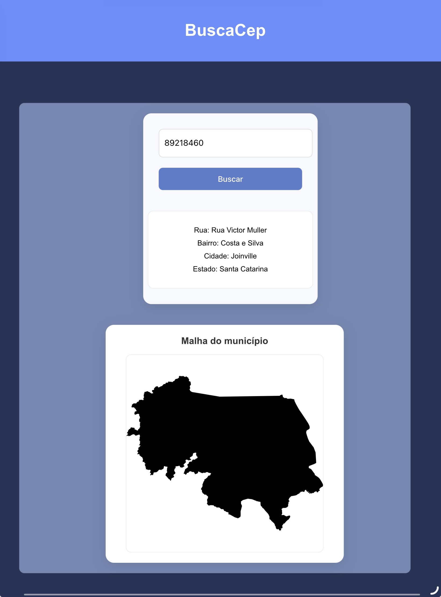

# BuscaCep
BuscaCep é uma atividade de API's no Angular desenvolvida na Bosch durante as aulas de front-end com o professor Marcelo Petri. Desenvolvido por Beatriz e Ana Julya.
## Proposta
Nossa proposta foi usar uma API de cep para encontrar as informações do cep que o usuário digitar e mostrar na tela, além de usar o código do IBGE para puxar a malha geográfica da cidade a partir da API de malhas geográficas do IBGE.  
  

## Desenvolvimento
Para esse projeto escolhemos 2 API’s:   
**Via cep** `https://viacep.com.br/ws/01001000/json/`  
**IBGE malhas geográficas** `https://servicodados.ibge.gov.br/api/docs/malhas?versao=4`
### Componentes
- **CEP-INPUT:**  
O componente **cep-input** é o componente central da aplicação, responsável por receber o CEP digitado pelo usuário, buscar as informações do endereço na API e preparar os dados que serão exibidos na interface.  
O arquivo **cep-input.html** é responsável pela interface do componente. Nele, o usuário pode digitar o CEP em um campo de input que está ligado à variável cep através do _**ngModel**_. Quando o botão de busca é clicado, a função `getCep()` é executada. 
No arquivo **cep-input.ts** estão definidas as variáveis e a função responsável por realizar a busca do CEP. A principal função do componente é `getCep()`, que chama o método `buscarCep()` presente no **CepService**, enviando como parâmetro o CEP digitado pelo usuário.  
Quando a requisição é realizada, a função recebe a resposta da API através do `subscribe()`. Os dados retornados são então armazenados na variável endereco, que segue o formato definido pela interface **CepInterface**. Além das informações do endereço, a resposta da API também contém o código IBGE do município, permitindo que o componente responsável pelo mapa possa carregar a imagem da malha.  
Para exibir os resultados na tela, são utilizadas diretivas condicionais. Quando o CEP é válido e os dados são retornados corretamente, as informações do endereço armazenadas na variável endereco são exibidas. Caso ocorra algum erro, é mostrada uma mensagem de erro através da variável erro. Durante o tempo de resposta da requisição, também pode ser exibida uma mensagem de loading, indicando que a busca ainda está em andamento.
- **MALHA:**  
Esse componente é responsável por exibir a malha geográfica do município na tela.  
Primeiro, o componente **cep-input** faz a busca do CEP usando o **cep.service**. Quando a API retorna os dados do endereço, ele pega o **código IBGE** do cep.  
Esse código IBGE é enviado para o **malha.service**, que monta a URL da malha geográfica do município utilizando o código. O service então retorna essa URL para o componente **cep-input**.  
Depois disso, o **cep-input** usa um `@Output()` para enviar essa URL para o componente pai, que é o **main-page**.  
O **main-page** recebe essa URL e a passa para o componente malha através do HTML usando data binding: `<app-malha [malhaUrl]="malhaUrl"></app-malha>`  
No componente **malha.ts**, essa variável é recebida usando` @Input()`.
Por fim, o **malha.html** usa essa URL como fonte da imagem: ``  
Esse binding faz com que a imagem da malha geográfica do município seja carregada e exibida na tela.  
- **MAIN-PAGE:**
O componente **main-page** funciona como o componente pai da aplicação, sendo responsável por organizar a estrutura principal da interface e intermediar a comunicação entre os outros componentes.  
Ele carrega os componentes **cep-input e malha**, que possuem funções diferentes dentro do sistema. Enquanto o **cep-input** é responsável por receber o CEP digitado pelo usuário e buscar as informações do endereço, o **malha** é responsável por exibir a malha geográfica do município correspondente.  
Para que esses dois componentes possam trocar informações, o **main-page** atua como intermediário. Quando o componente **cep-input** obtém o código do IBGE e gera a URL da malha geográfica, ele envia essa informação para o componente pai através de um `@Output()`. O **main-page** recebe esse valor e o armazena em uma variável.  
Em seguida, essa mesma variável é passada para o componente **malha** através de data binding no HTML, utilizando a sintaxe `[malhaUrl]="malhaUrl"`. Dessa forma, o componente **malha** consegue receber a URL e utilizá-la para carregar e exibir a imagem da malha geográfica na tela.  
Assim, o **main-page** tem como principal função estruturar a página e gerenciar a comunicação entre os componentes, garantindo que os dados obtidos na busca do CEP possam ser utilizados corretamente para mostrar o mapa do município.
 ## Considerações finais
A atividade foi muito enriquecedora, pois permitiu aprofundar o conhecimento sobre o consumo de APIs em aplicações web. Durante o desenvolvimento, foi possível trabalhar com a integração de duas APIs diferentes, em que os dados obtidos da primeira foram utilizados como base para realizar a consulta na segunda. Essa dependência entre as requisições tornou o desafio mais interessante, pois exigiu compreender como manipular e reutilizar as informações recebidas para gerar novos resultados na aplicação.  
Além disso, tivemos a oportunidade de conhecer e aplicar novos recursos do Angular, como os decorators `@Output()` e `@Input()`, que permitem a comunicação entre componentes. Com isso, também foi possível compreender melhor o conceito de componentes pai e filho, entendendo como os dados podem ser compartilhados entre diferentes partes da aplicação de forma organizada e estruturada.  
No geral, tivemos facilidade em construir a base da aplicação, sendo a única dificuldade a integração das APIs entre si usando os services. Escolhemos APIs simples justamente para facilitar o aprendizado e nos permitir finalizar uma boa página web com calma e insights de verdade, entendendo cada passo que tomamos e refletindo sobre nossas escolhas.
